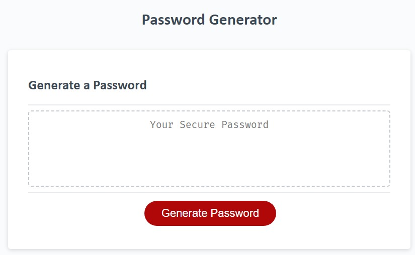

# UTCB-Challenge-03: JavaScript - Password Generator
This is challenge 3 for the UT Coding Bootcamp (JavaScript Challenge: Password Generator).

> This module's Challenge requires you to create an application that an employee can use to generate a random password based on criteria they've selected.   
>This app will run in the browser, and will feature dynamically updated HTML and CSS powered by JavaScript code that you write.   
>It will have a clean and polished user interface that is responsive, ensuring that it adapts to multiple screen sizes.

## Description

The goal of this project is to further my understanding of basic JavaScript by designing a password generator that meets specific criteria. (See User Stories and Acceptance Criteria in issues.)

### Learning Moments  

While trying to do data validation on user input, I learned that not all numbers are created equal. [MDN `typeof()`](https://developer.mozilla.org/en-US/docs/Web/JavaScript/Reference/Operators/typeof)
```
typeof NaN === "number"; // Despite being "Not-A-Number"
typeof Number("1") === "number"; // Number tries to parse things into numbers
typeof Number("shoe") === "number"; // including values that cannot be type coerced to a number
```

## Table of Contents

If your README is long, add a table of contents to make it easy for users to find what they need.

- [Installation](#installation)
- [Usage](#usage)
- [Credits](#credits)
- [License](#license)

## Installation

https://austinbq02.github.io/c03-password-generator/

## Usage

Navigate to the website listed above, the press the big read button.



Input the desired length for your password.


Follow the instructions on screen. Click Okay to include that type of character in your password or cancel to pass.


Copy your randomly generated password.


Click the big red button to start over.


## Credits

Full-Stack Blog - Professional README Guide: 
- https://coding-boot-camp.github.io/full-stack/github/professional-readme-guide

Traversy Media - JavaScript Password Generator tutorial
- Youtube - https://youtu.be/duNmhKgtcsI
- Codepen - https://codepen.io/FlorinPop17/pen/BaBePej 

```
List your collaborators, if any, with links to their GitHub profiles.

If you used any third-party assets that require attribution, list the creators with links to their primary web presence in this section.

If you followed tutorials, include links to those here as well.
```
## License

Please see LICENSE file.


---
